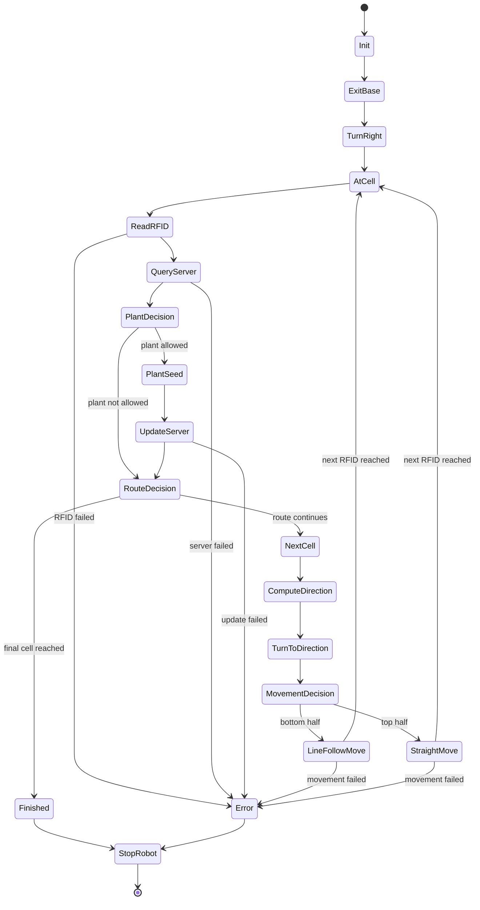

## Complete Easy-Mission State Machine

````mermaid
stateDiagram-v2
    [*] --> Init

    Init --> ExitBase
    ExitBase --> TurnRightToStartRoute
    TurnRightToStartRoute --> ReadRFID

    ReadRFID --> QueryServer: RFID detected
    ReadRFID --> Error: RFID read failed

    QueryServer --> CheckPlantingConditions: server response received
    QueryServer --> Error: server query failed

    CheckPlantingConditions --> PlantSeed: fertile && not already planted && seedsRemaining > 0
    CheckPlantingConditions --> CheckRouteComplete: do not plant

    PlantSeed --> NotifyServerSeedPlanted
    NotifyServerSeedPlanted --> CheckRouteComplete: update successful
    NotifyServerSeedPlanted --> Error: update failed

    CheckRouteComplete --> Finished: current cell is final route cell
    CheckRouteComplete --> SelectNextCell: more cells remain

    SelectNextCell --> CalculateRequiredHeading
    CalculateRequiredHeading --> TurnToNextCell
    TurnToNextCell --> SelectMovementMode

    SelectMovementMode --> FollowLineToNextRFID: next cell is in bottom half
    SelectMovementMode --> DriveStraightToNextRFID: next cell is in top half

    FollowLineToNextRFID --> ReadRFID: next RFID reached
    FollowLineToNextRFID --> Error: movement/RFID failure

    DriveStraightToNextRFID --> ReadRFID: next RFID reached
    DriveStraightToNextRFID --> Error: movement/RFID failure

    Finished --> StopRobot
    Error --> StopRobot

    StopRobot --> [*]
```
````

### A slightly cleaner version, with the planting and movement decisions made more explicit:

Easy-Mission State Machine With Decision Nodes



```md


```
