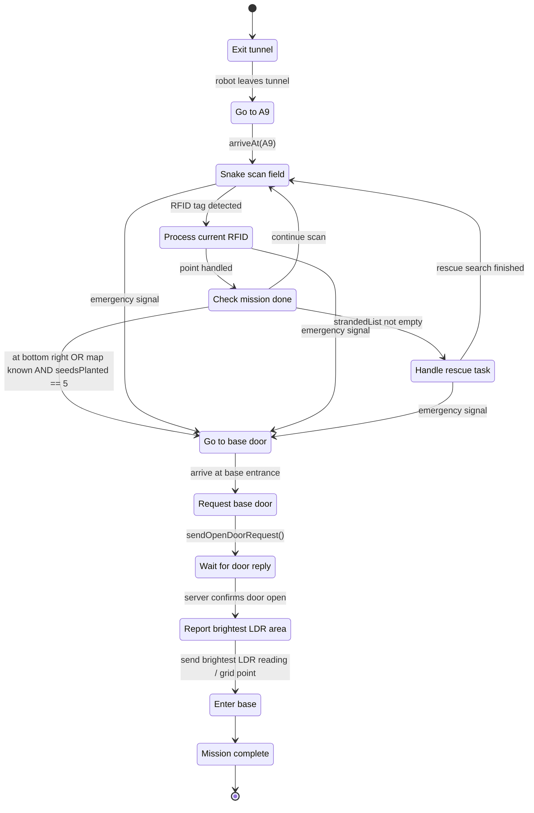
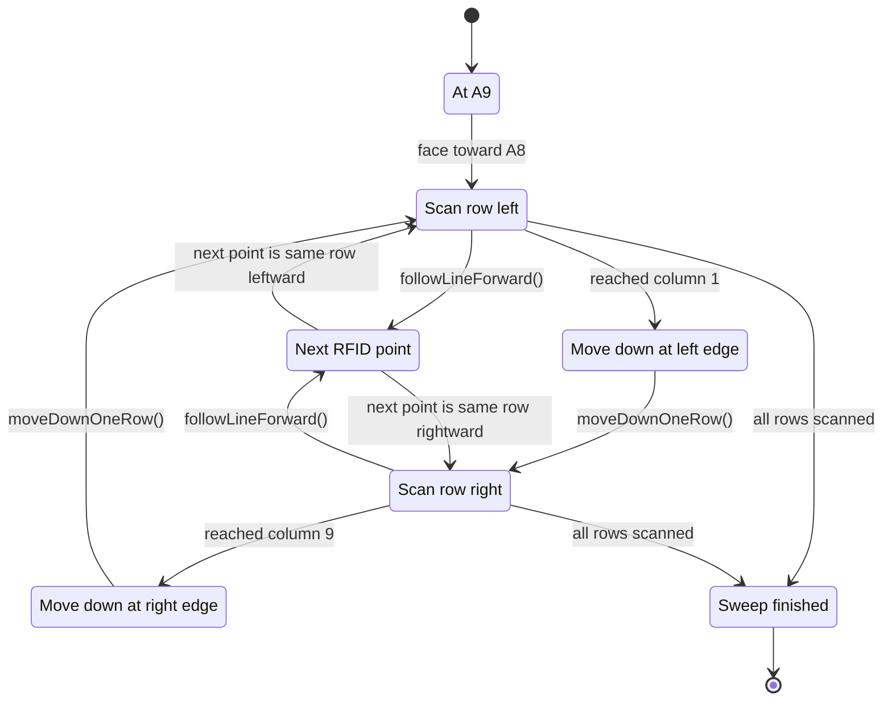
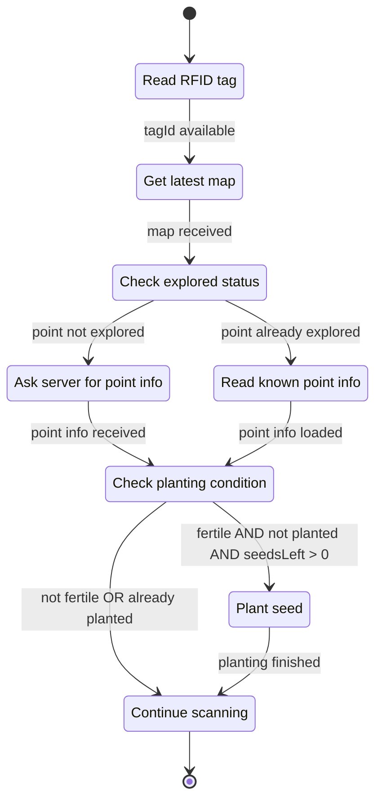
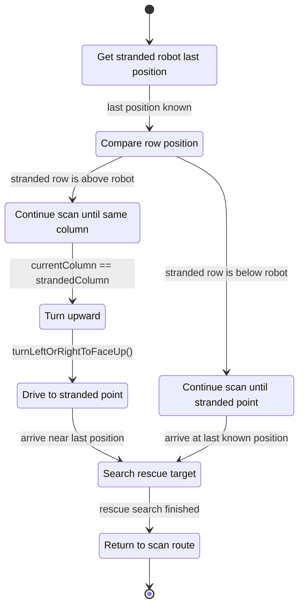
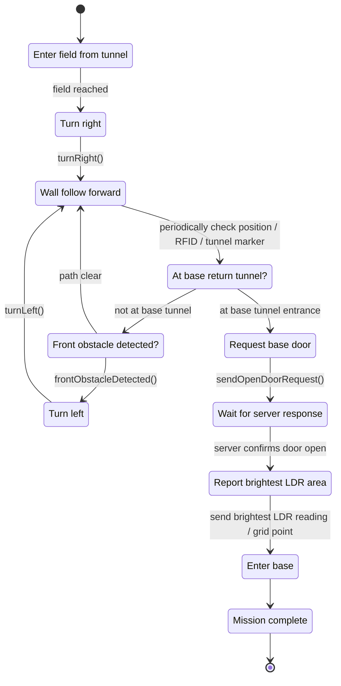

# simple & medium

### over all strategy

### snake scan FSM

### RFID processing FSM

### Rescue FSM

# hard&harder strategy

#### Seed planting is same as simple&medium; rescue signal is ignored.
